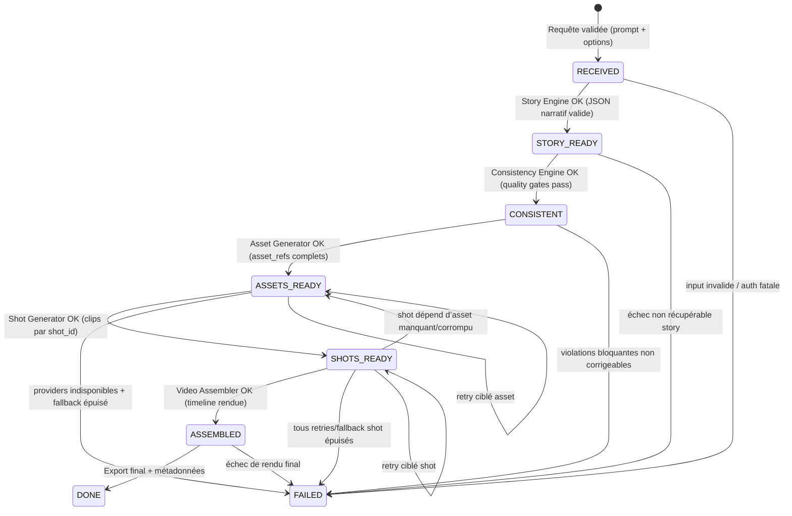

# Orchestration Flow — Narratech V1

Ce document décrit le flux d’orchestration global, la machine d’états, les contrats d’entrée/sortie des modules et les stratégies de reprise/fallback provider.

---

## 1) Machine d’états globale

États cibles:

`RECEIVED -> STORY_READY -> CONSISTENT -> ASSETS_READY -> SHOTS_READY -> ASSEMBLED -> DONE | FAILED`

### 1.1 Diagramme simple (transitions + critères)

### 1.2 Critères de passage par état

- **RECEIVED → STORY_READY**
  - `prompt` présent, options minimales valides.
  - sortie `narrative_json` conforme au schéma V1.
- **STORY_READY → CONSISTENT**
  - règles de cohérence validées (personnages, continuité visuelle, continuité narrative).
  - quality gates au-dessus des seuils définis.
- **CONSISTENT → ASSETS_READY**
  - tous les assets persistants requis sont générés et référencés (`asset_refs`).
- **ASSETS_READY → SHOTS_READY**
  - chaque `shot_id` attendu dispose d’un clip valide (durée/format OK).
- **SHOTS_READY → ASSEMBLED**
  - timeline complète, ordre narratif respecté, transitions minimales appliquées.
- **ASSEMBLED → DONE**
  - export final produit + traces provider + statut de pipeline persistant.
- **→ FAILED**
  - erreur fatale non récupérable après retries/fallback définis.

---

## 2) Entrées / sorties des modules

Référence d’organisation: `core/*`, `generation/*`, `assembly/*`.

## 2.1 `core/story_engine.py`

- **Entrées**
  - `prompt` (string)
  - `duration_sec`, `style`, `language`
  - `request_id`
- **Sorties**
  - `narrative_json` (synopsis, characters, scenes, shots, audio_plan, render_plan)
  - `provider_trace`, `latency_ms`, `cost_estimate`, `model_name`
- **État produit**: `STORY_READY`

## 2.2 `core/consistency_engine.py`

- **Entrées**
  - `narrative_json`
  - règles de cohérence / quality gates
- **Sorties**
  - `consistency_packet`
  - rapport de validation (violations + sévérité)
  - `narrative_json` enrichi/corrigé (si correction non destructive)
- **État produit**: `CONSISTENT`

## 2.3 `generation/asset_generator.py`

- **Entrées**
  - `narrative_json` validé
  - `consistency_packet`
  - `request_id`
- **Sorties**
  - `asset_refs[]` (personnages, environnements, URI/path, seed éventuel)
  - `provider_trace`, `latency_ms`, `cost_estimate`, `model_name`
- **État produit**: `ASSETS_READY`

## 2.4 `generation/shot_generator.py`

- **Entrées**
  - `narrative_json` (shots)
  - `asset_refs[]`
  - `consistency_packet`
  - `request_id`
- **Sorties**
  - `clips[]` indexés par `shot_id` (uri/path, durée, fps, provider)
  - `provider_trace`, `latency_ms`, `cost_estimate`, `model_name`
- **État produit**: `SHOTS_READY`

## 2.5 `assembly/video_assembler.py`

- **Entrées**
  - `clips[]`
  - `render_plan`
  - (optionnel) pistes audio
- **Sorties**
  - `final_video_uri` / `output_path`
  - métriques assemblage (durée, codec, résolution)
- **État produit**: `ASSEMBLED` puis `DONE`

## 2.6 `assembly/audio_engine.py` (complément pipeline)

- **Entrées**
  - `audio_plan`
  - `request_id`
- **Sorties**
  - `tracks[]` (voix off, ambiance)
  - métadonnées provider
- **Impact état**
  - enrichit `SHOTS_READY`/`ASSEMBLED` mais ne modifie pas la progression principale si mode muet autorisé.

---

## 3) Politique de reprise en cas d’échec partiel

Principe: **reprise locale d’abord**, jamais relancer la story complète sans nécessité.

### 3.1 Règles générales de reprise

- Granularité minimale: **shot** > asset > scène > story.
- Conserver `request_id` + `scene_id` + `shot_id` pour idempotence et traçabilité.
- Retry borné par étape (ex: 3 tentatives max avec backoff + jitter).
- Retry uniquement sur erreurs transitoires (`timeout`, `rate_limit`).
- Erreurs fatales (`auth`, réponse invalide persistante) → fallback ou `FAILED`.

### 3.2 Matrice de reprise recommandée

- **Échec d’un shot unique**
  - Action: régénérer **uniquement ce `shot_id`** avec même `asset_refs` et même `consistency_packet`.
  - Ne pas relancer `Story Engine`.
- **Échec sur plusieurs shots d’une même scène**
  - Action: régénération scène ciblée (shots de la scène), réutiliser assets existants.
- **Asset manquant/corrompu**
  - Action: régénérer l’asset concerné, puis regénérer seulement les shots dépendants.
- **Violation de cohérence détectée tardivement**
  - Action: retry ciblé avec `retry_focus` / `violation_targets`, sans réécrire toute la narration.
- **Échec d’assemblage**
  - Action: relancer uniquement `video_assembler` (et audio sync si requis), sans regénération des clips.

### 3.3 Conditions d’escalade

Escalade au niveau supérieur uniquement si:

1. retries locaux épuisés,
2. fallback provider indisponible,
3. dépendances amont invalides (ex: asset structurellement inutilisable).

---

## 4) Fallback provider (Sora -> Runway -> placeholder)

Ordre de priorité pour `Shot Generator`:

1. **Sora (primaire)**
2. **Runway (secondaire)**
3. **Placeholder clip (dernier recours)**

### 4.1 Déclencheurs de fallback

Basculer vers le provider suivant si l’un des critères est vrai:

- timeout après retries configurés,
- rate-limit persistant après retries,
- circuit-breaker ouvert sur provider courant,
- erreur de capacité (modèle temporairement indisponible).

Ne pas fallback automatiquement sur:

- `auth error` (problème de configuration à corriger),
- réponse invalide systémique (nécessite correction adapter/prompt).

### 4.2 Contrat du placeholder

Si Sora et Runway échouent:

- générer un clip de substitution (image fixe animée ou carton narratif),
- conserver `shot_id`, durée cible, et continuité timeline,
- marquer `quality_flag = degraded` dans les métadonnées,
- permettre un rerun asynchrone ultérieur pour remplacement transparent.

### 4.3 Politique d’acceptation dégradée

- Si `degraded_ratio <= seuil` (ex: 20% des shots): pipeline peut terminer en `DONE` avec avertissement.
- Si `degraded_ratio > seuil`: état final `FAILED` ou `DONE_WITH_WARNINGS` selon politique produit.

---

## 5) Résumé opérationnel

- Pipeline piloté par états explicites et critères testables.
- Reprise locale prioritaire pour limiter coût/latence.
- Fallback provider ordonné pour maximiser disponibilité.
- Placeholder assumé comme mécanisme de continuité, pas comme qualité finale.
